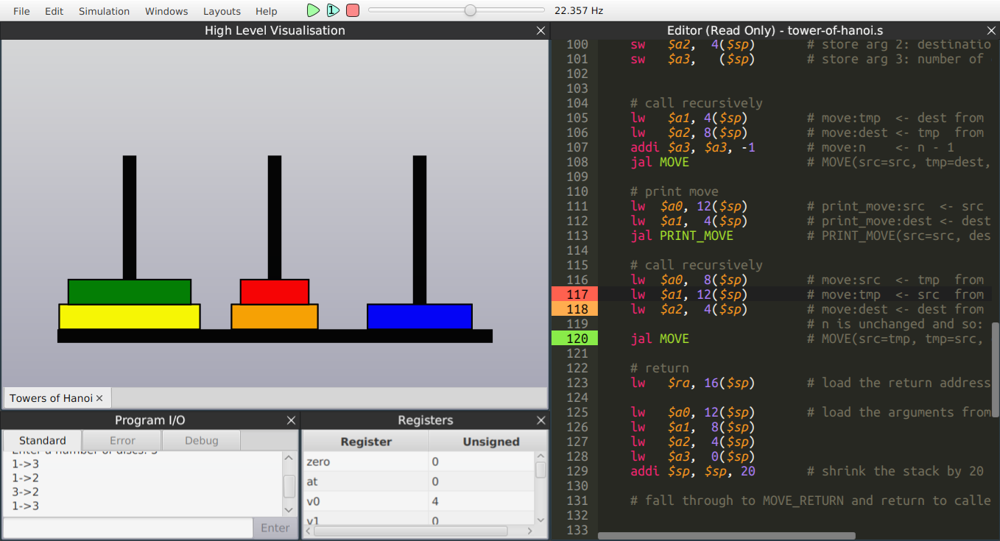
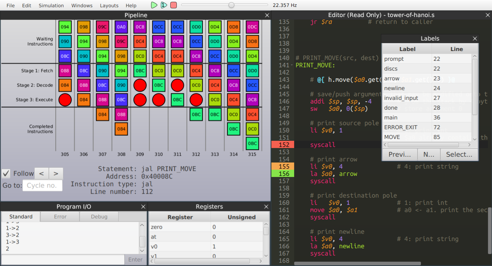
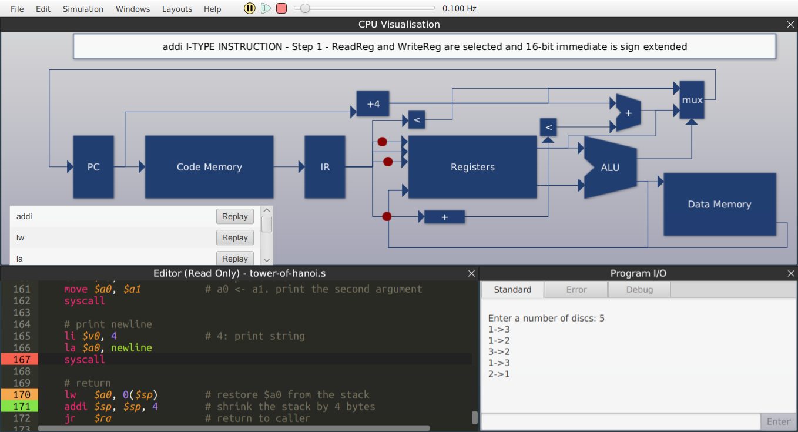

Simulizer allows you to write assembly code and run it on a simulated and visualised CPU. It has been designed to improve various features of [SPIM](http://spimsimulator.sourceforge.net).

[User Guide](work/guide.pdf)

[Final Report](https://github.com/mbway/Simulizer/raw/master/docs/Final-Report.pdf) (contains a more in depth description)

Features
--------
- A code editor with syntax highlighting for the MIPS language, along with real-time error checking and tooltips.
- Simulation and visualisation of an abstract simplified CPU.
- A window showing the values of the registers as programs are running.
- Interaction with the CPU, e.g. controlling the clock speed, pausing, stepping through execution, etc.
- Helpful messages and animations as the simulation is running to help the user understand how the CPU is operating.
- High-level visualisation of annotated programs, see below.

Screenshots
-----------

Example Algorithm Visualisation:

Example Pipeline Visualisation:

Example CPU Visualisation:

Annotations
-----------
Simulizer uses a JavaScript engine along side the CPU emulation. Javascript code is placed between `@{` and `}@` delimiters inside MIPS comments. The JavaScript code can access information about the current state of the CPU (eg registers, memory etc) and can be used to:
- signal 'high level' algorithm visualisations (eg integer lists: swapping elements and highlighting elements, tower of Hanoi: disk swapping, bitmap rendering of memory location etc)
- prototype complex code before transcribing to assembly
- debugging tool (very useful for `printf` debugging or conditional breakpoints)

High-Level Visualiation
-----------------------
The current data structures/graphics that can be visualised are:
- Lists
- Tower of Hanoi

Meet the Team
-------------
 |  |  |  | 
---|---|---|---|---|
[Charlie Street](https://github.com/charlie1329) | [Kelsey McKenna](https://github.com/ToastNumber) | [Matthew Broadway](https://github.com/mbway) | [Michael Oultram](https://github.com/MichaelOultram) | [Theo Styles](https://github.com/ThusStyles)

Building
--------
Package dependencies to build on a 64 bit Debian based GNU/Linux System (eg Ubuntu)
- `openjdk-8-jdk`
- `spim` (for compatiability tests)
- `openjfx` (JavaFX for openJDK-8)
- `gradle` (or use gradle plugin with an IDE or the `gradlew` wrapper)
- add `/usr/lib/jvm/java-8-openjdk-amd64/jre/lib/ext/jfxrt.jar` to the SDK classpath
    - your placement might be different. try: `find /usr -name 'jfxrt.jar'`
    - in Intellij IDEA: File > Project Structure > SDKs > 1.8 > Classpath
- gradle will handle the rest of the dependencies

Compiler Compatability
----------------------
It is possible to use a compiler to generate MIPS output which Simulizer can
consume (with some manual editing). See `work/gcc-mips.sh` for a script which
uses gcc to cross compile for MIPS (the gcc cross compiler must be installed
manually).

Licence
-------
**Simulizer** is released under the [GNU General Public License v3.0](LICENCE)
